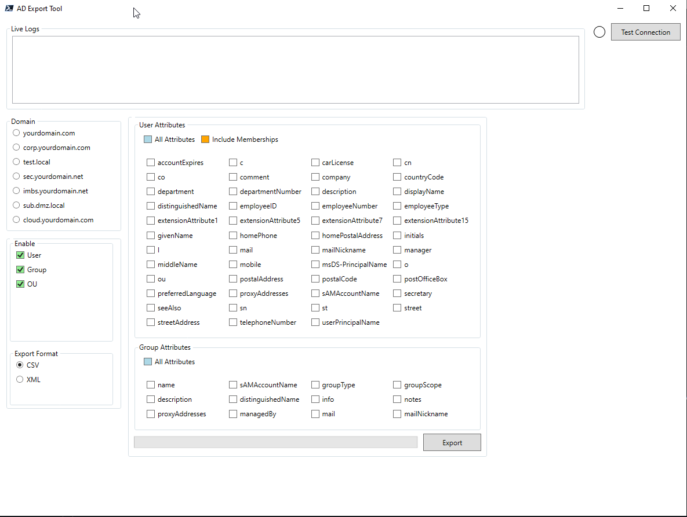

# PowerShell Active Directory Export Tool

## Short Description

This is a simple but powerful PowerShell script that provides a Graphical User Interface (GUI) for exporting User, Group, and Organizational Unit (OU) objects from Active Directory. It's designed for system administrators who need a quick and easy way to generate reports in either CSV or XML format.



---

## Features

* **Simple GUI:** Built with PowerShell and WPF, so it's easy to use without complex commands.
* **Object Export:** Export Users, Groups, and/or OUs.
* **Selective Attribute Export:** Choose exactly which attributes you want to export for Users and Groups, or select all of them with a single click.
* **Multiple Export Formats:** Export your data to either CSV for easy use in Excel or to XML for structured data needs.
* **Connection Testing:** A simple status light indicates if a connection to the selected domain is successful before you start an export.
* **Live Logging:** A log window shows the script's progress and any errors in real-time.

---

## Requirements

1.  **Operating System:** Windows 10/11 or Windows Server 2016 and newer.
2.  **PowerShell:** Version 5.1 or higher.
3.  **Active Directory Module:** The `ActiveDirectory` PowerShell module must be installed. This is part of the Remote Server Administration Tools (RSAT). You can install it with this command:
    ```powershell
    # Run this in an elevated PowerShell window
    Add-WindowsCapability -Online -Name Rsat.ActiveDirectory.DS-LDS.Tools~~~~0.0.1.0
    ```

---

## Setup and Configuration

Before you can use the script, you **must** configure it for your own environment by changing the placeholder domain names.

1.  **Download:** Download the `.ps1` script file to your local machine.
2.  **Edit the Script:** Open the script file in a text editor (like VS Code, Notepad++, or the PowerShell ISE).
3.  **Update Domain List:**
    * Find the section in the script that defines the XAML, specifically the `<GroupBox Header="Domain">` section.
    * Change the `Content` property for each `<RadioButton>` to your actual domain names.
    * For example, change `Content="yourdomain.com"` to `Content="mycompany.local"`.

    ```xml
    <GroupBox Header="Domain" HorizontalAlignment="Left" Margin="10,170,0,0" VerticalAlignment="Top" Width="200" Height="200">
        <StackPanel>
            <RadioButton x:Name="rbDomain1" Content="yourdomain.com" Margin="5"/>
            <RadioButton x:Name="rbDomain2" Content="corp.yourdomain.com" Margin="5"/>
            </StackPanel>
    </GroupBox>
    ```

4.  **Update the Logic:**
    * Scroll down to the `Get-SelectedDomain` function in the script.
    * Update the string values there to match the domains you entered in the XAML.

    ```powershell
    # Find this function in the script
    Function Get-SelectedDomain {
        # CHANGE THESE STRING VALUES TO MATCH YOUR DOMAINS
        if ($rbDomain1.IsChecked -eq $true) { return "yourdomain.com" }
        elseif ($rbDomain2.IsChecked -eq $true) { return "corp.yourdomain.com" }
        # ...and so on for the others
        else { return $null }
    }
    ```

---

## How to Run

1.  Open a PowerShell terminal.
2.  Navigate to the directory where you saved the script.
3.  You may need to adjust your execution policy for the script to run. For a single session, you can use:
    ```powershell
    Set-ExecutionPolicy -Scope Process -ExecutionPolicy RemoteSigned
    ```
4.  Run the script:
    ```powershell
    .\Your-Script-Name.ps1
    ```

### Usage Instructions

1.  **Select Domain:** Choose the domain you want to query from the list.
2.  **Test Connection:** Click the "Test Connection" button. The light next to it should turn green.
    * 🔴 **Red:** Connection failed. Check the domain name and network connectivity.
    * 🟡 **Yellow:** Testing in progress.
    * 🟢 **Green:** Connection successful.
3.  **Choose What to Export:** In the "Enable" section, check the boxes for Users, Groups, and/or OUs.
4.  **Select Attributes:** For Users and Groups, you can now select the specific attributes you wish to export. Use the "All Attributes" checkbox to quickly select/deselect everything.
5.  **Select Export Format:** Choose between CSV and XML.
6.  **Export:** Click the "Export" button. The progress bar will show the status.
7.  **Find Your Files:** The exported files will be saved in a folder under `C:\Exports\<domain_name>\`.

---

## License

This project is licensed under the **GNU General Public License v3.0**. See the `LICENSE.md` file for details.
